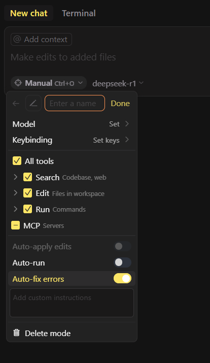

https://www.cursor.com/changelog/chat-tabs-custom-modes-sound-notification

**Cursor 0.48.x**

Joy=) As I already wrote in the 0.46 branch and after in 0.47, an unpleasant interface decision was made to pack everything into single chat tab, and it was very inconvenient after I got used to two. Finally, everything was fixed, and now it's possible to open as many tabs as you want (!) via "+" and include any modes in them.

For each mode ("agent", "ask", "manual" - previously "Edit" was confused with "Ask" and thus renamed) you can now set your own hotkey and fix the model.

In the settings, you can enable the ability to create **additional modes** ([custom modes](https://docs.cursor.com/chat/custom-modes)) with the choice of model, hotkey, a bunch of settings, MCP, and even a custom instruction. A very good response to the Roo Code plugin!

Also now if in the chat the context window starts to cut off the beginning of the conversation, it will be written in small text at the bottom.

*So far there are no new models `deepseek-v3.1` and `gemini-2.5-pro` in the list, but I think they will appear soon.*

#cursor #mcp