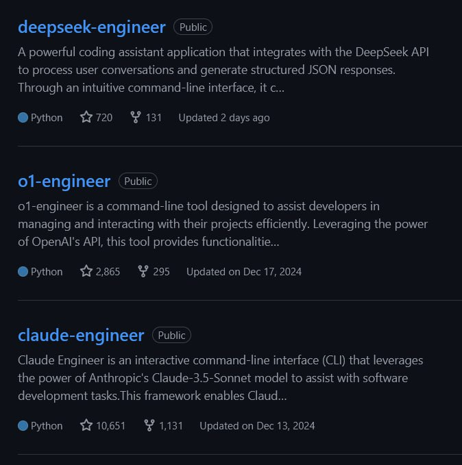

<!--
date: 2025-01-23T12:07:59
photo: 
-->

Doriandarko (Pietro Schirano) creates **assistants** for programmers on top of the most common top LLM models.

These are Python scripts that work from the command line (can be opened in the Terminal tab in VS Code). Similar to Aider, but simpler.

[https://github.com/Doriandarko/deepseek-engineer](https://github.com/Doriandarko/deepseek-engineer)

#autocomplete 