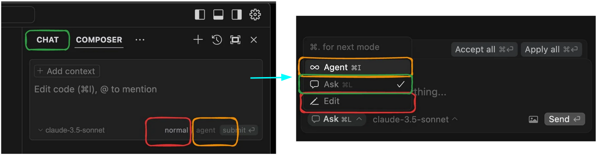

[Cursor](https://www.cursor.com/) has been gradually releasing **version 0.46** since February 19th, which radically and controversially **changes the AI interaction interface**.

Initially, Cursor only had a *Chat* feature where users could communicate and receive code modification suggestions—requiring users to press an "apply" button. Later, a separate *Composer* was introduced, capable of simultaneously working with multiple files and suggesting edits. The Composer also introduced an *agent* mode, where changes are applied first and then a diff is displayed for review, meaning changes are accepted by default. 

Over recent months, all **three modes** found their niches in my workflow, and I believe many Cursor users similarly chose which mode to use based on their specific needs.

🚨 Now they've decided to merge *Chat* and *Composer* into a single panel window with a simple dropdown list offering three options (with hotkeys available for only two).

`Chat -> Ask`
`Composer (normal) -> Edit`
`Composer (agent) -> Agent`

The only advantage (available in beta features in settings) is that they now share context. Everything else feels less convenient so far. Particularly frustrating is that you can no longer bind specific models to specific modes—I previously used slower `thinking` models in Chat and Claude for Composer.

I don't fully understand why this simplification was implemented. They claim it's to avoid confusion, but I never experienced any confusion — I clearly understood when to use each mode. Previously, everyone copied Cursor as the industry leader, but now they seem to be following Windsurf's / Cline's approach.

*They've also given the agent the ability to search the internet and use MCP.*

Another peculiarity of the Cursor website is the inability to download **older versions**. I found the [cursor-ai-downloads](https://github.com/oslook/cursor-ai-downloads) repository, where someone has been collecting all download links since version 0.36.2, for which I'm very grateful! After installation, you'll need to disable the update service (see instructions for your OS).

#cursor 