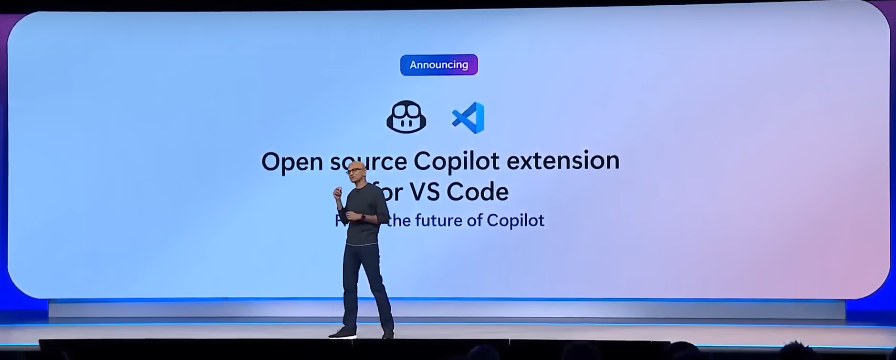

GitHub Copilot is also not very good with naming; now under the name **agent** will also be the cloud agent in response to the agent from OpenAI.

https://github.blog/changelog/2025-05-19-github-copilot-coding-agent-in-public-preview/
The cloud Copilot agent can **automatically solve tasks** in the repository: **assign an issue** (or several) — it will analyze the code, make changes, test with tests, and send a PR for review. Copilot works in the background, using a **secure cloud environment** (based on GitHub Actions). Available only for Copilot Pro+ and Enterprise, consumes GitHub Actions minutes.

Apparently, GitHub Copilot for VSCode is not developing as quickly and well as competitors, so MS decided to **open-source** its code to everyone. Grok 3 model was also added.

https://jules.google/
Google's announcement also includes such a cloud **agent Jules**, but only a waitlist is on the website. Also, for some reason, the design is made like a pixel game.
UPD: During I/O, they announced beta access for users from the USA (5 total tasks per day)

https://docs.anthropic.com/en/docs/claude-code/sdk
Claude Code SDK. **Anthropic announced an SDK** for their agent programming system from the console. In fact, it doesn't look like the usual one, where we can connect some product to our code and interact with it. More precisely, it doesn't look like that yet, it says "The SDK currently support command line usage". That is, they rather expanded the possibilities of interacting with it from the console.

#githubcopilot #vscplugin #claudecode