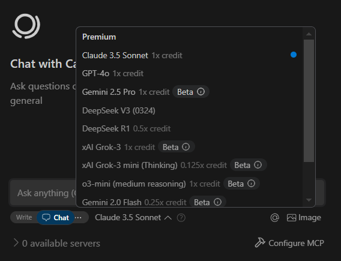

https://console.x.ai/
Модель **xAI Grok-3** нарешті доступна через API

В доповненнях для програмування де можна додавати свої ключі (Cline, Roo) тепер можна використовувати як напряму, так й через https://openrouter.ai/x-ai/grok-3-beta

У **Windsurf** доступні всі топові моделі на сьогодні, включаючи Gemini 2.5 Pro (яка попереду у багатьох тестах) та DeepSeek V3 (0324).

Так само у **Cursor** тепер у налаштування можна обрати `deepseek-v3.1`, `grok-3-beta`, `gemini-2.5-pro-exp-03-25` та `gemini-2.5-pro-max`.

У **Trae** немає зараз ні моделей від Google, ні від xAI.

#grok #newllmmodel #windsurf #cursor #cline