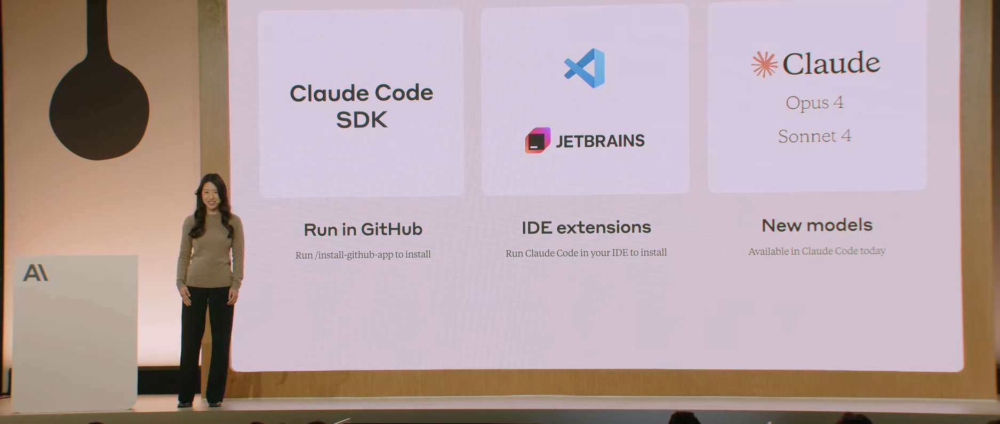

Наступною цього тижня була презентація від Anthropic.

Івент називався "**Code w/ Claude**" тобто вони прямо зробили акцент на програмування.

https://www.anthropic.com/news/claude-4
Презентували **4 версію Opus та Sonnet**. Моделі мають всі сучасні фічі - мислення, пошук в інтернеті, запуск коду, використання інструментів та MCP, правки локальних файлів  (які Opus може використовувати як пам'ять). Кеш запитів розширили з секунд до години. Кажуть, що Opus може 8 годин працювати як фоновий автономний агент.

Google, посилаючись на статистику Cursor, казали, що за останні місяці дуже багато людей перейшло у ньому на Gemini 2.5 Pro. Цікаво, чи оновлення поверне людей до Sonnet (модель вже є у налаштуваннях Cursor). 

У GitHub Copilot у безкоштовному плані тільки Claude 3.5 Sonnet, у Pro додали Claude 4.0 Sonnet (Preview), а щоб використовувати Opus треба бути на Pro+ підписці.

Також оновили свій **Claude Code** інструмент. Тепер підтримує фонові завдання через GitHub Actions та нативні інтеграції з VS Code і JetBrains, відображаючи зміни безпосередньо у IDE.

Тобто вони теж зробили фонового агента, якому можна давати завдання з репозиторіїв і потім перевірити зроблене: "Позначайте Claude Code у пулл-реквестах, щоб відповідати на відгуки рецензентів, виправляти помилки CI або змінювати код. Щоб встановити, запустіть `/install-github-app` з Claude Code."

Цікаво, що виступав представник GitHub і, схоже, їх фоновий агент на сайті теж працює на моделі від Anthropic, а не OpenAI Codex як я спочатку подумав на їх анонсі.

#claudecode #newllmmodel 